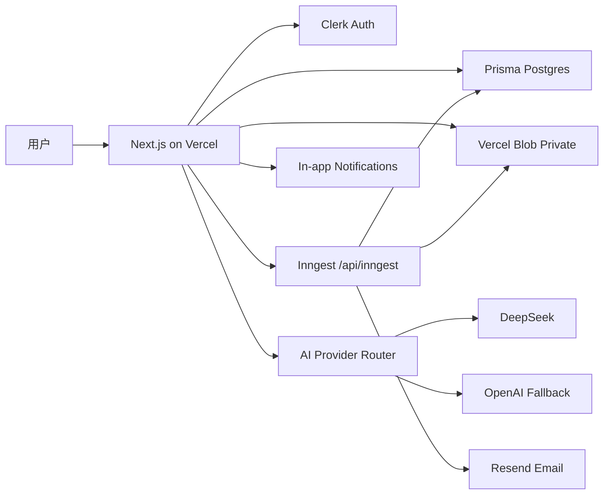

# MVP 技术细节定稿

版本: v0.1  
日期: 2026-06-05  
状态: MVP 已选型，可进入项目初始化与实现

---

## 1. 已确认约束

用户已确认:

- 支持多用户。
- AI 主通道使用 DeepSeek。
- 保留 GPT/OpenAI API Key 通道。
- 部署到 Vercel。
- 需要真实通知能力。
- 需要读取用户上传文件。

MVP 目标:

先做一个可真实运行的 Web App，让多用户可以创建项目、上传任务资料、让 AI 拆解任务、确认计划、生成每日任务、接收提醒、更新进度，并让系统持续调整 DDL 和结果预估。

---

## 2. MVP 最优技术栈

| 模块 | 选型 | 结论 |
| --- | --- | --- |
| 语言 | TypeScript | 全项目唯一语言，避免 schema/type 分裂 |
| 包管理 | pnpm | 安装快、lockfile 稳定，适合 monorepo 扩展 |
| Node.js | 24.x | Vercel 当前默认 LTS，可在 `package.json` engines 锁定 |
| Web 框架 | Next.js 16.x App Router | Vercel 原生部署，适合 AI 流式接口、Server Actions、文件上传 |
| UI | React + Tailwind CSS | 快速构建黑色/天蓝/一笔画界面，并实现 highlighter 透明错位描边/填色 |
| UI primitives | Radix UI + 少量自建组件 | 交互稳定，不被现成组件库风格锁死 |
| 表单 | react-hook-form + Zod | 多步骤向导、确认表单、服务端校验统一 |
| 动效 | motion | 用于一笔画路径、节点浮现、DDL rail 过渡 |
| AI SDK | `ai` + `@ai-sdk/deepseek` + `@ai-sdk/openai` | DeepSeek 主用，OpenAI 备用，不把业务绑定到单一 provider |
| 主模型 | `deepseek-v4-flash` | 默认抽取、追问、日常聊天、进度分析 |
| 强模型 | `deepseek-v4-pro` | 复杂任务节点拆解、最终计划、结果预估 |
| GPT 备用 | `gpt-5.4-mini` 默认，`gpt-5.5` 强备用 | 仅在 DeepSeek 失败、质量不足或用户切换时使用 |
| 鉴权 | Clerk | 多用户最快落地，Next.js App Router 支持成熟 |
| 数据库 | Prisma Postgres | 与 Prisma/Vercel 路径最短，内置连接池适合 serverless |
| ORM | Prisma ORM | 类型安全、迁移明确、后续可扩展 |
| 文件存储 | Vercel Blob Private Store | 上传文件私有保存，Vercel 集成成本低 |
| 后台任务 | Inngest | 替代 BullMQ，适合 Vercel serverless、定时、重试、延迟任务 |
| 邮件通知 | Resend | Next.js 适配好，MVP 真实通知首选 |
| 站内通知 | Postgres `Notification` 表 | 保证通知可审计、可重试、可读状态 |
| 浏览器通知 | Web Push 作为 P1 | 邮件先上线，浏览器推送随后接入 |
| 文件解析 | Inngest 后台解析 | 上传后异步抽取文本、摘要、评分标准 |
| PDF 文本 | pdf-parse 或 pdfjs-dist | MVP 支持文字型 PDF |
| DOCX 文本 | mammoth | MVP 支持 Word 文档 raw text 提取 |
| 图片 OCR | tesseract.js | MVP 支持普通 JPG/PNG 图片文字提取 |
| 监控 | Vercel Observability + Inngest dashboard | 先覆盖函数、后台任务、失败重试 |

---

## 3. 关键取舍

### 3.1 后台任务不用 BullMQ

原技术文档中推荐过 Redis + BullMQ，但 MVP 部署目标是 Vercel。BullMQ 的最佳形态是 Redis + 常驻 worker，而 Vercel 函数不是常驻 worker 环境。

最终决定:

- MVP 使用 Inngest。
- 不引入 Redis。
- 不维护独立 worker 服务。
- 后续如果迁移到自托管服务器或 Cloud Run，再考虑 BullMQ。

原因:

- Inngest 可在 Next.js 项目内声明函数。
- 支持事件触发、cron、延迟执行、重试、步骤级恢复。
- 部署到 Vercel 时只需要暴露 `/api/inngest`。
- 更适合文件解析、邮件提醒、计划重算这类 serverless 背景任务。

### 3.2 DeepSeek 作为主 AI provider

DeepSeek 官方 API 当前支持 OpenAI/Anthropic 兼容调用格式。DeepSeek 文档显示 `deepseek-chat` 和 `deepseek-reasoner` 将在 2026-07-24 弃用，因此 MVP 不使用这两个模型名。

最终模型策略:

```text
fast/default  -> deepseek-v4-flash
strong        -> deepseek-v4-pro
fallback      -> gpt-5.4-mini
strongBackup  -> gpt-5.5
```

OpenAI 通道只作为可切换 provider，不做默认依赖。

### 3.3 鉴权选择 Clerk

MVP 需要多用户，但不应把时间花在登录系统细节上。

最终决定:

- 使用 Clerk 做登录、注册、会话、middleware。
- 应用数据库中保留 `AppUser` 表，把 `clerkUserId` 映射到本地用户。
- 所有项目数据仍存储在自己的 Postgres 中，不依赖 Clerk 存业务数据。

如果后续要完全自控鉴权，可迁移到 Auth.js/Better Auth，但 MVP 不选它们。

### 3.4 通知先做邮件 + 站内

真实通知不是做一个假 UI。MVP 必须可以真的提醒用户。

最终决定:

- 邮件通知: Resend。
- 站内通知: Postgres 表 + header bell + 通知页。
- 浏览器推送: P1，邮件稳定后接入。
- 微信/短信/Telegram: 不进入 MVP，除非你明确要求。

MVP 通知场景:

- 每日早上任务提醒。
- 晚上进度反馈提醒。
- safe DDL 前提醒。
- hard DDL 前强提醒。
- 计划重排需要用户确认。
- 文件解析完成。
- AI 预估结果明显变化。

### 3.5 文件解析先做“足够有用”，不做重型 RAG

MVP 需要读取文件，但不需要一开始就做复杂向量库。

最终决定:

- 文件原件存 Vercel Blob private store。
- 解析文本和摘要存 Postgres。
- 按项目、文档、章节、页码/段落存 chunks。
- AI 使用相关 chunks 生成背景、要求、评分项、限制条件。
- MVP 不上 pgvector，不做 embeddings。
- 如果文档超过上下文限制，先做“分块摘要 + 关键规则抽取”。

MVP 支持:

- `.pdf`: 文字型 PDF。
- `.docx`: Word 文档。
- `.txt`, `.md`: 纯文本。
- `.png`, `.jpg`, `.jpeg`: 普通图片 OCR。

MVP 暂不承诺:

- 多页扫描 PDF 的高质量 OCR。
- 表格还原。
- 手写文字 OCR。
- 复杂版式精确还原。

如果你要求扫描版 PDF 也必须高质量识别，需要改选专业 OCR 服务，这会改变成本和实现。

---

## 4. 运行架构



### 4.1 请求路径

用户实时操作:

```text
Browser -> Next.js Server Action/Route Handler -> Prisma Postgres
```

AI 流式聊天:

```text
Browser -> /api/ai/chat -> AI Provider Router -> DeepSeek/OpenAI -> stream response
```

文件上传:

```text
Browser -> Vercel Blob Private Store -> create UploadedFile row -> Inngest event
```

文件解析:

```text
Inngest file.uploaded -> fetch private blob -> parse text -> extract requirements -> save DocumentInsight
```

通知:

```text
Plan approved -> Inngest schedules reminders -> Resend email + Notification row
```

---

## 5. 代码结构定稿

```text
src/
  app/
    (auth)/
      sign-in/
      sign-up/
    (workspace)/
      layout.tsx
      projects/
      today/
      notifications/
      settings/
    api/
      ai/
        chat/route.ts
        object/route.ts
      files/
        upload/route.ts
      inngest/route.ts
      webhooks/
        clerk/route.ts
  components/
    ui/
    sketch/
    project/
    planning/
    notifications/
  server/
    actions/
      project.actions.ts
      progress.actions.ts
      confirmation.actions.ts
      notification.actions.ts
    application/
      projects/
      planning/
      progress/
      documents/
      notifications/
      estimation/
    domain/
      project/
      workflow/
      task/
      schedule/
      estimation/
    ai/
      providers.ts
      model-router.ts
      prompts/
      schemas/
      workflows/
    infrastructure/
      db/
      auth/
      blob/
      email/
      documents/
      rate-limit/
  inngest/
    client.ts
    functions/
      document-extraction.ts
      planning.ts
      reminders.ts
      estimation.ts
      notifications.ts
prisma/
  schema.prisma
```

---

## 6. AI Provider Router

### 6.1 环境变量

```text
AI_PRIMARY_PROVIDER=deepseek
AI_FALLBACK_PROVIDER=openai

DEEPSEEK_API_KEY=
DEEPSEEK_FAST_MODEL=deepseek-v4-flash
DEEPSEEK_STRONG_MODEL=deepseek-v4-pro

OPENAI_API_KEY=
OPENAI_FALLBACK_MODEL=gpt-5.4-mini
OPENAI_STRONG_MODEL=gpt-5.5
```

### 6.2 Provider 路由规则

| 场景 | 默认模型 | 备用模型 |
| --- | --- | --- |
| Step 1 动作/目的抽取 | deepseek-v4-flash | gpt-5.4-mini |
| Step 2 背景追问 | deepseek-v4-flash | gpt-5.4-mini |
| Step 3 节点拆解 | deepseek-v4-pro | gpt-5.5 |
| Step 4 三轮确认 | deepseek-v4-flash | gpt-5.4-mini |
| Step 5 每日计划 | deepseek-v4-pro | gpt-5.5 |
| Step 6 进度调整 | deepseek-v4-flash | gpt-5.4-mini |
| 结果预估 | deepseek-v4-pro | gpt-5.5 |
| 用户普通询问 | deepseek-v4-flash | gpt-5.4-mini |

### 6.3 AI 调用原则

- 用 `streamText` 做聊天与解释。
- 用 `generateObject` 做结构化抽取和计划草案。
- 用 Zod schema 校验所有 AI 输出。
- 所有关键写入通过 application service，不让模型直接写库。
- DeepSeek 失败、超时、schema 失败两次后切换 OpenAI fallback。
- 保存 `AITrace`，记录 provider、model、耗时、token usage、schema 结果。

---

## 7. 数据模型新增项

原技术文档已有项目、目标、需求、任务、计划等核心表。MVP 需要补充以下表。

```prisma
model AppUser {
  id          String   @id @default(cuid())
  clerkUserId String   @unique
  email       String
  name        String?
  timezone    String   @default("Asia/Shanghai")
  createdAt   DateTime @default(now())
  updatedAt   DateTime @updatedAt
}

model UploadedFile {
  id           String   @id @default(cuid())
  projectId    String
  ownerId      String
  blobUrl      String
  pathname     String
  filename     String
  mimeType     String
  sizeBytes    Int
  status       FileStatus @default(Uploaded)
  createdAt    DateTime @default(now())
  updatedAt    DateTime @updatedAt
}

model DocumentChunk {
  id             String   @id @default(cuid())
  uploadedFileId String
  projectId      String
  chunkIndex      Int
  sourceLabel     String?
  text            String
  tokenEstimate   Int
  createdAt       DateTime @default(now())
}

model DocumentInsight {
  id             String   @id @default(cuid())
  uploadedFileId String
  projectId      String
  summary        String
  requirements   Json
  deadlines      Json?
  scoringRules   Json?
  constraints    Json?
  confidence     Float
  createdAt      DateTime @default(now())
}

model Notification {
  id          String   @id @default(cuid())
  userId      String
  projectId   String?
  type        NotificationType
  title       String
  body        String
  status      NotificationStatus @default(Unread)
  scheduledAt DateTime?
  createdAt   DateTime @default(now())
  readAt      DateTime?
}

model NotificationDelivery {
  id             String   @id @default(cuid())
  notificationId String
  channel        NotificationChannel
  provider       String
  providerId     String?
  status         DeliveryStatus
  error          String?
  sentAt         DateTime?
  createdAt      DateTime @default(now())
}

enum FileStatus {
  Uploaded
  Extracting
  Extracted
  Failed
}

enum NotificationType {
  DailyPlan
  ProgressCheck
  SafeDeadline
  HardDeadline
  PlanApproval
  FileProcessed
  EstimateChanged
}

enum NotificationStatus {
  Unread
  Read
  Archived
}

enum NotificationChannel {
  InApp
  Email
  BrowserPush
}

enum DeliveryStatus {
  Pending
  Sent
  Failed
  Skipped
}
```

---

## 8. Inngest 工作流

### 8.1 文件解析

触发事件:

```text
file.uploaded
```

步骤:

1. 标记文件为 `Extracting`。
2. 从 Vercel Blob 读取文件。
3. 根据 MIME type 解析文本。
4. 切分 chunk。
5. 调用 AI 提取比赛/任务要求、DDL、评分项、限制条件。
6. 保存 `DocumentChunk` 和 `DocumentInsight`。
7. 发送站内通知和邮件通知。

### 8.2 计划生成

触发事件:

```text
project.context.completed
```

步骤:

1. 读取用户填写信息和文件 insights。
2. 生成任务节点。
3. 生成三轮确认草案。
4. 等待用户确认。
5. 用户确认后生成每日计划。

### 8.3 每日提醒

触发事件:

```text
plan.approved
```

步骤:

1. 为每个 DailyTask 创建站内通知。
2. 用 `sleepUntil` 安排邮件提醒。
3. 到点发送 Resend 邮件。
4. 写入 `NotificationDelivery`。

### 8.4 进度重算

触发事件:

```text
progress.logged
task.missed
deadline.risk.detected
```

步骤:

1. 读取当前计划和完成情况。
2. 重新计算剩余工时和风险。
3. 更新结果预估。
4. 如果计划变化大，生成待确认调整方案。
5. 通知用户确认。

---

## 9. MVP 页面范围

### 必做页面

- 登录/注册。
- 项目列表。
- 项目创建 6 步向导。
- 文件上传和解析状态。
- 三轮确认页面。
- 计划预览和批准页面。
- 今日任务页面。
- 项目地图页面。
- 进度反馈页面。
- 通知中心。
- 设置页面: 时区、提醒时间、AI fallback 开关。

### 暂不做页面

- 团队协作。
- 管理后台。
- 公开分享页。
- 模板市场。
- 第三方日历配置页。

---

## 10. 第一版实现顺序

1. 初始化 Next.js 16 + Node 24 + pnpm。
2. 接入 Clerk，多用户会话打通。
3. 接入 Prisma Postgres，创建核心 schema。
4. 接入 Vercel Blob，完成私有文件上传。
5. 接入 Inngest，跑通本地 dev server 和 `/api/inngest`。
6. 接入 DeepSeek provider router，完成 Step 1 结构化抽取。
7. 接入文档解析 workflow。
8. 完成 6 步项目创建向导。
9. 完成计划生成、批准、每日任务。
10. 接入 Resend 邮件和站内通知。
11. 完成进度反馈、计划重排和结果预估。
12. 完成黑色/天蓝/一笔画 UI 打磨，重点实现透明 highlighter 错位描边、错位填色和低强度局部发光。
13. 上 Vercel 预览部署。
14. 做端到端测试。

---

## 11. 需要配置的外部服务

| 服务 | 用途 | 必需 |
| --- | --- | --- |
| Vercel | 部署 Next.js、Blob、环境变量 | 是 |
| Clerk | 多用户鉴权 | 是 |
| Prisma Postgres | 主数据库 | 是 |
| Inngest | 后台任务、定时、重试 | 是 |
| DeepSeek | 主 AI 模型 | 是 |
| OpenAI | GPT fallback 通道 | 是，但可先不启用 |
| Resend | 邮件通知 | 是 |

---

## 12. 不确定项与默认决定

目前我已经替 MVP 做出默认决定:

- 通知默认只做邮件 + 站内，浏览器推送作为 P1。
- 文件解析默认支持文字型 PDF、DOCX、TXT/MD、普通图片 OCR。
- 不做扫描 PDF 的高质量 OCR。
- 不做微信、短信、Telegram 通知。
- 不做 embeddings/向量库。

如果你现在明确需要以下能力，需要立刻改方案:

- 微信/短信/Telegram 必须进入 MVP。
- 扫描版 PDF 必须高质量 OCR。
- 所有文件必须完全本地解析，不能送第三方 AI。
- 不想用 Clerk 这类托管登录服务。
- 不想使用 Prisma Postgres。

---

## 13. 官方资料依据

以下资料在 2026-06-05 用于确认 MVP 技术选型:

- Next.js App Router: https://nextjs.org/docs/app
- Next.js 16.2: https://nextjs.org/blog/next-16-2
- Vercel Node.js versions: https://vercel.com/docs/functions/runtimes/node-js/node-js-versions
- Vercel Blob: https://vercel.com/docs/vercel-blob
- Vercel Cron Jobs: https://vercel.com/docs/cron-jobs
- Prisma Next.js + Vercel: https://www.prisma.io/docs/guides/nextjs
- Prisma Postgres connection pooling: https://www.prisma.io/docs/postgres/database/connection-pooling
- Inngest Next.js quick start: https://www.inngest.com/docs/getting-started/nextjs-quick-start
- Inngest on Vercel: https://www.inngest.com/docs/deploy/vercel
- Inngest scheduled functions: https://www.inngest.com/docs/guides/scheduled-functions
- Clerk Next.js App Router: https://clerk.com/docs/nextjs/getting-started/quickstart
- Resend Next.js: https://resend.com/nextjs
- DeepSeek API docs: https://api-docs.deepseek.com/
- AI SDK DeepSeek provider: https://v5.ai-sdk.dev/providers/ai-sdk-providers/deepseek
- AI SDK tool calling: https://ai-sdk.dev/docs/ai-sdk-core/tools-and-tool-calling
- AI SDK structured object streaming: https://v5.ai-sdk.dev/docs/reference/ai-sdk-core/stream-object
- OpenAI Responses API: https://platform.openai.com/docs/api-reference/responses/create
- OpenAI models: https://developers.openai.com/api/docs/models/all
- mammoth DOCX parsing: https://www.npmjs.com/package/mammoth
- pdf-parse: https://www.npmjs.com/package/pdf-parse
