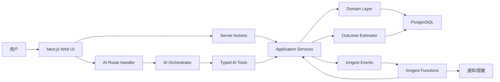
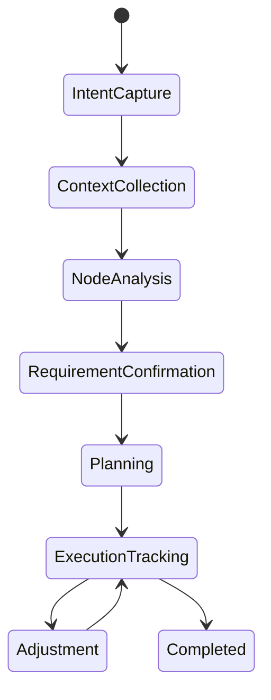
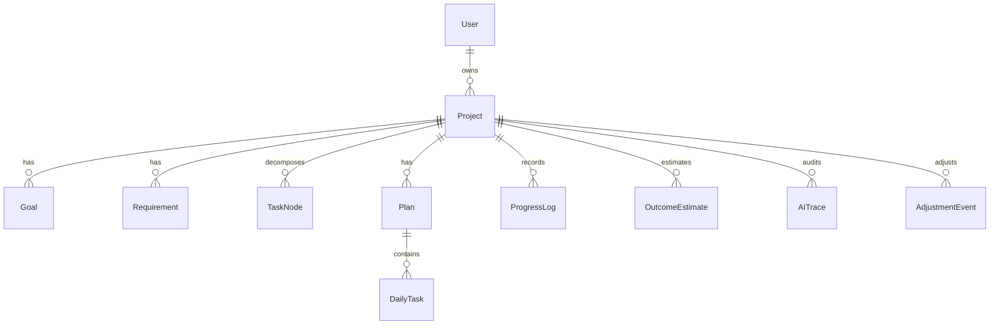

# 项目管理辅助 AI 技术文档

版本: v0.1  
日期: 2026-06-05  
目标: 设计一个基于 JavaScript/TypeScript 的项目管理辅助 AI。用户只需描述任务，系统通过结构化追问、任务节点拆解、价值判断、三轮确认、每日计划和持续调整，帮助用户稳定推进目标，并持续预估结果。

---

## MVP 技术细节已定稿

MVP 的具体技术选型已经收敛到 [MVP_TECHNICAL_DECISIONS.md](./MVP_TECHNICAL_DECISIONS.md): 多用户使用 Clerk，AI 主通道使用 DeepSeek 并保留 OpenAI fallback，部署到 Vercel，后台任务使用 Inngest，文件存储使用 Vercel Blob，真实通知先使用 Resend 邮件 + 站内通知。

## 1. 产品定位

### 1.1 一句话定义

这是一个“目标驱动的 AI 项目推进器”，不是普通待办清单，也不是只会聊天的 AI。它把用户的模糊任务转成可执行计划，并在执行中持续更新任务、DDL、风险和达成概率。

### 1.2 核心用户场景

用户输入:

> 我要参加这个比赛，目的是获取名次。

系统需要逐步得到:

- 用户真正要做的动作: 参加比赛。
- 主目标: 获取名次。
- 背景信息: 什么比赛、规则、命题、评审标准、截止日期。
- 用户能力: 能做什么、做得怎么样、可投入时间、资源限制。
- 任务节点: 报名、理解命题、调研、方案、原型、作品制作、测试、包装、提交、复盘。
- 价值拆分: 哪些节点对“拿名次”贡献最大，哪些节点对“软件效果”贡献最大。
- 可执行计划: 每天做什么，做到什么质量，什么时候检查。
- 安全 DDL: 比官方截止更早，包含缓冲、检查和补救窗口。
- 持续调整: 根据进度和新情况自动改任务、改 DDL、改预估结果。

### 1.3 产品原则

1. 先结构化，再智能化。
   AI 输出必须进入可验证的数据结构，不能只保存在聊天记录里。

2. 先目标，再任务。
   每个任务都要能回到主目标或子目标，否则就不应该进入计划。

3. 先安全 DDL，再极限 DDL。
   系统默认生成可完成、可检查、可补救的时间表。

4. AI 永远给出“估计”而非确定承诺。
   结果预估必须展示依据、风险和不确定性。

5. 用户拥有最终控制权。
   AI 可以建议调整，但关键确认、删除、延期、降级目标都需要用户明确确认。

---

## 2. 推荐 JS 架构

### 2.1 总体选择

推荐采用:

- 语言: TypeScript
- 应用框架: Next.js App Router
- UI: React + Tailwind CSS
- AI 层: Vercel AI SDK 风格的 provider-agnostic 编排
- 数据库: PostgreSQL
- ORM: Prisma
- 后台任务: Inngest（MVP）；Redis + BullMQ 仅作为后续自托管 worker 备选
- 服务端状态同步: Server Components + Server Actions/Route Handlers
- 客户端异步状态: TanStack Query，仅用于高互动面板
- 数据校验: Zod
- 可视化/手绘风格: SVG + Rough.js 思路的一笔画线条组件

### 2.2 为什么选择 Next.js 全栈架构

这个产品既有强 UI，又有服务端 AI 编排、数据库、鉴权、任务调度和实时更新。早期不建议拆成多个微服务，复杂度会过早上升。

Next.js App Router 适合承载:

- 多步骤任务创建页面。
- 项目仪表盘。
- 服务端渲染的项目状态。
- AI 流式输出接口。
- 表单提交和确认动作。
- 后续可扩展的公开 API。

架构关键点:

- 页面和布局由 App Router 管理。
- 查询型数据优先在 Server Component 获取。
- 表单提交、确认、进度更新用 Server Actions。
- AI 流式聊天、文件上传、webhook、外部客户端调用用 Route Handlers。
- 业务逻辑不写在页面组件里，统一进入 `server/application` 和 `server/domain`。

### 2.3 为什么不是纯前端 SPA

不推荐只做 React SPA + 后端 API，原因:

- AI API 密钥和调度逻辑必须在服务端。
- 任务计划和 AI 推理需要持久化审计。
- 后台 DDL 监控无法靠浏览器完成。
- 多端同步和权限控制会变复杂。

### 2.4 为什么不是一开始就微服务

当前产品核心难点不是吞吐，而是工作流正确性、计划质量和持续调整体验。早期应使用模块化单体:

- 一个 Next.js 应用承载 Web、API、AI orchestrator。
- 一个 worker 进程承载定时任务、提醒、重算、外部同步。
- 数据库和队列独立部署。

当出现以下情况再拆服务:

- AI 编排耗时明显影响 Web 响应。
- 多团队协作需要独立部署计划引擎。
- 任务调度吞吐达到单 worker 难以支撑。
- 需要开放公共 API 或第三方集成市场。

---

## 3. 系统架构总览



### 3.1 分层说明

| 层 | 职责 | 禁止事项 |
| --- | --- | --- |
| UI Layer | 页面、交互、展示、动效 | 不写业务规则、不直接拼 AI prompt |
| Application Layer | 用例编排、事务、权限检查 | 不依赖 React，不返回 UI 组件 |
| Domain Layer | 项目、目标、任务、DDL、进度、估计模型 | 不调用数据库、不调用 LLM |
| AI Layer | 结构化抽取、追问、拆解、计划生成、重算 | 不直接写库，必须走工具或 use case |
| Infrastructure Layer | Prisma、Redis、LLM provider、通知、文件存储 | 不承载业务决策 |
| Worker Layer | 定时检查、提醒、计划重排、结果预估刷新 | 不绕过权限和审计 |

### 3.2 模块边界

```text
src/
  app/
    (marketing)/
    (workspace)/
      projects/
      today/
      review/
    api/
      ai/
      webhooks/
  components/
    ui/
    project/
    planning/
    sketch/
  server/
    actions/
    application/
      create-project-flow/
      planning/
      progress/
      estimation/
      notifications/
    domain/
      project/
      workflow/
      task/
      schedule/
      estimation/
    ai/
      orchestrator/
      prompts/
      tools/
      schemas/
    infrastructure/
      db/
      queue/
      auth/
      storage/
      llm/
  workers/
    scheduler-worker.ts
  lib/
    dates/
    result/
    permissions/
prisma/
  schema.prisma
```

---

## 4. 用户流程和 AI 工作流

### 4.1 流程状态机

项目创建不是一段无限聊天，而是一台明确的状态机。



### 4.2 Step 1: 动作与目的

用户输入任意自然语言，AI 抽取:

- action: 用户要做什么。
- purpose: 为什么做。
- primaryGoal: 主目标。
- goalType: 名次、交付、学习、收益、申请、考试、作品、研究等。
- initialDeadline: 用户是否提到了截止时间。
- ambiguity: 模糊点。

示例结构:

```ts
type IntentCapture = {
  action: string;
  purpose: string;
  primaryGoal: string;
  goalType: "ranking" | "delivery" | "learning" | "exam" | "application" | "research" | "other";
  initialDeadline?: string;
  ambiguity: string[];
};
```

AI 在这一步只做“抽取和确认”，不急着生成完整计划。

### 4.3 Step 2: 背景、要求、期望目标、能力判断

系统追问四类信息:

1. 背景
   - 什么比赛/项目/任务。
   - 面向谁。
   - 规则、命题、赛道、提交形式。
   - 时间线和官方 DDL。

2. 要求
   - 硬性要求。
   - 格式要求。
   - 评分项。
   - 禁止项。

3. 期望目标
   - 比赛希望看到什么。
   - 评委/客户/老师/用户关心什么。
   - 可验证的目标结果。

4. 个人能力判断
   - 用户能做什么。
   - 做得怎么样。
   - 可投入时间。
   - 资源、队友、设备、预算。

数据结构:

```ts
type ContextPacket = {
  background: {
    eventName?: string;
    domain?: string;
    audience?: string;
    officialDeadline?: string;
    submissionFormat?: string[];
  };
  requirements: Requirement[];
  expectedSignals: ExpectedSignal[];
  capability: CapabilityProfile;
};

type Requirement = {
  id: string;
  text: string;
  type: "hard" | "soft" | "format" | "quality" | "constraint";
  source: "user" | "uploaded_doc" | "ai_inferred";
  confidence: number;
};

type ExpectedSignal = {
  text: string;
  target: "judge" | "customer" | "teacher" | "user" | "self";
  evidenceNeeded: string[];
};

type CapabilityProfile = {
  skills: Array<{
    name: string;
    level: "unknown" | "beginner" | "intermediate" | "advanced";
    evidence?: string;
  }>;
  availableHoursPerDay: number;
  weakPoints: string[];
  resources: string[];
};
```

### 4.4 Step 3: 任务节点分析与价值拆分

系统生成任务节点图，不只是列表。

节点包含:

- 节点名称。
- 输入。
- 输出。
- 依赖。
- 价值贡献。
- 风险。
- 预估工作量。
- 可验收标准。

价值拆分维度:

- 主目标贡献，例如“拿名次”。
- 子目标贡献，例如“软件效果”。
- 必须完成程度。
- 区分度。
- 风险降低。
- 学习成本。

```ts
type TaskNode = {
  id: string;
  title: string;
  narrativeRole: "setup" | "core" | "leverage" | "polish" | "submission" | "review";
  dependsOn: string[];
  output: string;
  acceptanceCriteria: string[];
  estimatedHours: number;
  value: {
    primaryGoalImpact: number;
    subGoalImpact: number;
    differentiation: number;
    riskReduction: number;
    mustHave: boolean;
  };
  risk: {
    level: "low" | "medium" | "high";
    reasons: string[];
  };
};
```

线性叙事输出:

系统把节点图转为用户能理解的推进线，例如:

1. 先确定赛题和评分标准。
2. 再找出最可能拉开差距的作品方向。
3. 接着做最小可展示原型。
4. 然后把核心效果做到稳定。
5. 最后包装材料、演示路径和提交检查。

### 4.5 Step 4: 三轮确认检查

系统对每个关键要求进行三轮确认。

第一轮: 需求清晰描述

- 用户到底要什么。
- 每条需求是否可理解。
- 是否有冲突。

第二轮: 转换为实际动作

- 每条需求对应哪些任务。
- 任务输出是什么。
- 如何验收。

第三轮: 对齐主目标与子目标

- 该任务如何服务主目标。
- 是否服务子目标。
- 是否值得投入。
- 是否需要降级、删除或推迟。

确认状态:

```ts
type ConfirmationItem = {
  id: string;
  requirementId: string;
  clearDescription: string;
  actionMapping: string[];
  goalAlignment: Array<{
    goalId: string;
    relation: "direct" | "indirect" | "weak" | "none";
    reason: string;
  }>;
  status: "draft" | "needs_user_input" | "confirmed" | "rejected";
  round: 1 | 2 | 3;
};
```

### 4.6 Step 5: 生成每日任务和安全 DDL

输入:

- 已确认需求。
- 任务节点图。
- 用户能力。
- 可投入时间。
- 官方 DDL。
- 当前日期。
- 风险等级。

输出:

- 每日任务。
- 每日验收标准。
- 软 DDL。
- 安全 DDL。
- 最晚 DDL。
- 检查点。
- 风险预案。

DDL 类型:

```ts
type DeadlineSet = {
  officialDueAt?: Date;
  hardDueAt: Date;
  safeDueAt: Date;
  reviewDueAt: Date;
  bufferHours: number;
  reason: string;
};
```

调度策略:

1. 先排硬性依赖。
2. 再排高价值任务。
3. 高风险任务前置。
4. 每天保留缓冲。
5. 提交日前至少留出一次完整检查。
6. 如果用户能力弱于任务难度，自动增加学习/验证节点。

### 4.7 Step 6: 持续调整

持续阶段每天收集:

- 完成了什么。
- 没完成什么。
- 卡在哪里。
- 今天可投入时间是否变化。
- 是否出现新要求。
- 用户是否改变目标。

系统动作:

- 重算剩余任务。
- 调整安全 DDL。
- 更新风险。
- 更新结果预估。
- 给出最小补救方案。
- 必要时建议目标降级。

```ts
type AdjustmentEvent = {
  id: string;
  projectId: string;
  reason: "progress_update" | "deadline_change" | "scope_change" | "capability_change" | "risk_found";
  beforePlanId: string;
  afterPlanId: string;
  userApproved: boolean;
  createdAt: Date;
};
```

---

## 5. AI Orchestrator 设计

### 5.1 设计原则

AI 层不能直接“随便聊完就算”。每一次 AI 调用必须满足:

- 有明确输入 schema。
- 有明确输出 schema。
- 输出经过 Zod 校验。
- 失败可重试。
- 结果可审计。
- 关键变更需要用户确认。

### 5.2 Orchestrator 结构

```text
server/ai/
  orchestrator/
    run-workflow-step.ts
    run-planning-pass.ts
    run-adjustment-pass.ts
    run-estimation-pass.ts
  prompts/
    system.ts
    intent.ts
    context.ts
    node-analysis.ts
    confirmation.ts
    planning.ts
    adjustment.ts
    estimation.ts
  tools/
    save-intent.ts
    upsert-requirements.ts
    create-task-nodes.ts
    propose-plan.ts
    update-progress.ts
    recalculate-estimate.ts
  schemas/
    intent.schema.ts
    context.schema.ts
    task-node.schema.ts
    plan.schema.ts
```

### 5.3 推荐 AI 工具调用方式

模型不直接写数据库。模型只能调用类型化工具，工具再调用 application service。

```ts
const tools = {
  upsertRequirements: tool({
    description: "Create or update structured project requirements after user confirmation.",
    inputSchema: UpsertRequirementsSchema,
    execute: async (input) => {
      return requirementService.upsert(input);
    },
  }),
  proposeDailyPlan: tool({
    description: "Generate a candidate daily plan with safe deadlines.",
    inputSchema: ProposeDailyPlanSchema,
    execute: async (input) => {
      return planningService.createCandidatePlan(input);
    },
  }),
};
```

### 5.4 Prompt 分层

系统提示词固定产品原则:

- 先问缺失信息，不在缺信息时假装确定。
- 任务必须绑定目标。
- 不生成危险压缩 DDL。
- 不承诺结果，只做概率估计。
- 输出必须能转为结构化数据。

步骤提示词只负责当前阶段:

- Intent prompt 只抽取动作和目的。
- Context prompt 只补齐背景和能力。
- Node prompt 只拆节点和价值。
- Confirmation prompt 只做三轮确认。
- Planning prompt 只排每日任务。
- Adjustment prompt 只基于变化调整。
- Estimation prompt 只做结果预估。

### 5.5 AI 输出质量控制

每次 AI 输出后执行:

1. Schema validation。
2. Business rule validation。
3. Conflict detection。
4. Safety DDL validation。
5. User-facing explanation generation。
6. Audit log 保存。

示例业务校验:

```ts
function validatePlan(plan: PlanDraft, project: ProjectContext): ValidationIssue[] {
  const issues: ValidationIssue[] = [];

  if (plan.tasks.some((task) => !task.goalIds.length)) {
    issues.push({ code: "TASK_WITHOUT_GOAL", severity: "error" });
  }

  if (plan.safeDueAt >= plan.hardDueAt) {
    issues.push({ code: "SAFE_DDL_AFTER_HARD_DDL", severity: "error" });
  }

  if (plan.dailyHours.some((day) => day.hours > project.capability.availableHoursPerDay * 1.25)) {
    issues.push({ code: "OVERLOADED_DAY", severity: "warning" });
  }

  return issues;
}
```

---

## 6. 任务计划与 DDL 算法

### 6.1 任务评分

每个任务节点计算优先级:

```text
priority =
  primaryGoalImpact * 0.35 +
  mustHaveScore * 0.20 +
  riskReduction * 0.15 +
  differentiation * 0.15 +
  dependencyUnlockScore * 0.10 -
  uncertaintyPenalty * 0.05
```

说明:

- primaryGoalImpact: 对主目标的贡献。
- mustHaveScore: 硬性要求权重。
- riskReduction: 做完后能降低多少风险。
- differentiation: 是否能拉开差距。
- dependencyUnlockScore: 是否解锁后续任务。
- uncertaintyPenalty: 不确定性越高越需要拆小，不能直接塞进计划。

### 6.2 工时估计

```text
adjustedHours =
  baseEstimatedHours
  * skillModifier
  * uncertaintyModifier
  * contextSwitchModifier
```

推荐参数:

| 条件 | modifier |
| --- | --- |
| 用户高级能力 | 0.75 |
| 用户中级能力 | 1.00 |
| 用户初级能力 | 1.35 |
| 能力未知 | 1.50 |
| 需求不清晰 | 1.20 到 1.60 |
| 外部依赖强 | 1.20 |

### 6.3 安全 DDL 计算

```text
safeDueAt = hardDueAt - reviewBuffer - riskBuffer - submissionBuffer
```

推荐缓冲:

| 风险 | 缓冲 |
| --- | --- |
| low | 总周期 10% |
| medium | 总周期 20% |
| high | 总周期 30% 到 40% |

如果官方 DDL 为 2026-07-01 23:59，系统可能生成:

- reviewDueAt: 2026-06-27 18:00
- safeDueAt: 2026-06-29 20:00
- hardDueAt: 2026-07-01 18:00
- officialDueAt: 2026-07-01 23:59

### 6.4 每日任务生成

每日计划包含:

- primaryTask: 当天最重要任务。
- supportTasks: 辅助任务。
- acceptance: 今天完成的可验证证据。
- maxHours: 不超过用户承诺时间。
- fallback: 如果时间不够，保底做什么。
- reviewQuestion: 当天复盘问题。

```ts
type DailyTask = {
  date: string;
  primaryTask: string;
  supportTasks: string[];
  acceptanceCriteria: string[];
  estimatedHours: number;
  fallbackTask?: string;
  linkedGoalIds: string[];
  riskNote?: string;
};
```

### 6.5 计划重排规则

触发重排:

- 用户连续两天未完成关键任务。
- 新增硬性要求。
- 官方 DDL 改变。
- 任务质量未达验收标准。
- 用户可投入时间变化超过 30%。
- 结果预估下降超过 15%。

重排策略:

1. 保留已完成任务。
2. 重新计算剩余任务。
3. 删除低价值 polish。
4. 把高风险任务前置。
5. 必要时降低子目标。
6. 给用户展示变化原因。

---

## 7. 结果预估模型

### 7.1 输出内容

系统总是根据当前情况预估结果，但必须透明:

- 当前达成概率。
- 影响概率的前三个正向因素。
- 影响概率的前三个风险因素。
- 如果今天完成某任务，概率可能如何变化。
- 如果继续延期，概率可能如何变化。

### 7.2 估计维度

```ts
type OutcomeEstimate = {
  probability: number;
  confidence: "low" | "medium" | "high";
  factors: Array<{
    label: string;
    impact: "positive" | "negative";
    weight: number;
    explanation: string;
  }>;
  suggestedNextMove: string;
  createdAt: Date;
};
```

### 7.3 概率计算建议

MVP 使用可解释的启发式模型，不建议一开始训练复杂模型。

```text
probability =
  baseGoalFit * 0.20 +
  progressRatio * 0.25 +
  scheduleHealth * 0.20 +
  qualityEvidence * 0.15 +
  capabilityFit * 0.10 +
  riskControl * 0.10
```

维度说明:

- baseGoalFit: 目标和比赛/任务要求是否匹配。
- progressRatio: 已完成价值占比，而不是任务数量占比。
- scheduleHealth: 当前进度是否领先安全 DDL。
- qualityEvidence: 是否有可展示成果、测试结果、评审反馈。
- capabilityFit: 用户能力是否匹配任务难度。
- riskControl: 风险是否被提前处理。

输出示例:

```text
当前预估: 42% 到 55%
信心: medium
主要正向因素:
1. 核心功能已经进入可演示状态。
2. 作品方向与命题有直接关联。
3. 仍有 3 天安全缓冲。
主要风险:
1. 展示材料尚未成型。
2. 评审标准中的创新性证据不足。
3. 测试反馈样本太少。
建议今天优先做: 完成 1 分钟演示路径和截图材料。
```

---

## 8. 数据库设计

### 8.1 核心实体



### 8.2 Prisma 模型草案

```prisma
model User {
  id        String    @id @default(cuid())
  email     String    @unique
  name      String?
  projects  Project[]
  createdAt DateTime  @default(now())
  updatedAt DateTime  @updatedAt
}

model Project {
  id              String            @id @default(cuid())
  ownerId         String
  owner           User              @relation(fields: [ownerId], references: [id])
  title           String
  action          String
  purpose         String
  phase           ProjectPhase
  officialDueAt   DateTime?
  hardDueAt       DateTime?
  safeDueAt       DateTime?
  contextJson     Json?
  capabilityJson  Json?
  goals           Goal[]
  requirements    Requirement[]
  taskNodes       TaskNode[]
  plans           Plan[]
  progressLogs    ProgressLog[]
  estimates       OutcomeEstimate[]
  aiTraces        AITrace[]
  adjustments     AdjustmentEvent[]
  createdAt       DateTime          @default(now())
  updatedAt       DateTime          @updatedAt
}

model Goal {
  id          String   @id @default(cuid())
  projectId   String
  project     Project  @relation(fields: [projectId], references: [id])
  title       String
  type        GoalType
  priority    Int
  successText String
  createdAt   DateTime @default(now())
}

model Requirement {
  id          String          @id @default(cuid())
  projectId   String
  project     Project         @relation(fields: [projectId], references: [id])
  text        String
  type        RequirementType
  source      RequirementSource
  confidence  Float
  confirmedAt DateTime?
  createdAt   DateTime        @default(now())
  updatedAt   DateTime        @updatedAt
}

model TaskNode {
  id                 String    @id @default(cuid())
  projectId           String
  project             Project   @relation(fields: [projectId], references: [id])
  title               String
  narrativeRole       String
  dependsOn           String[]
  output              String
  acceptanceJson      Json
  estimatedHours      Float
  valueJson           Json
  riskJson            Json
  createdAt           DateTime  @default(now())
  updatedAt           DateTime  @updatedAt
}

model Plan {
  id          String     @id @default(cuid())
  projectId   String
  project     Project    @relation(fields: [projectId], references: [id])
  status      PlanStatus
  reason      String
  safeDueAt   DateTime
  hardDueAt   DateTime
  tasks       DailyTask[]
  createdAt   DateTime   @default(now())
  approvedAt  DateTime?
}

model DailyTask {
  id                 String     @id @default(cuid())
  planId             String
  plan               Plan       @relation(fields: [planId], references: [id])
  date               DateTime
  title              String
  details            String
  estimatedHours     Float
  acceptanceJson     Json
  fallbackTask       String?
  status             TaskStatus
  completedAt        DateTime?
}

model ProgressLog {
  id          String   @id @default(cuid())
  projectId   String
  project     Project  @relation(fields: [projectId], references: [id])
  date        DateTime
  summary     String
  blockers    String[]
  evidence    Json?
  createdAt   DateTime @default(now())
}

model OutcomeEstimate {
  id             String   @id @default(cuid())
  projectId      String
  project        Project  @relation(fields: [projectId], references: [id])
  probabilityMin Float
  probabilityMax Float
  confidence     String
  factorsJson    Json
  nextMove       String
  createdAt      DateTime @default(now())
}

model AITrace {
  id            String   @id @default(cuid())
  projectId     String
  project       Project  @relation(fields: [projectId], references: [id])
  workflowStep  String
  inputHash     String
  outputJson    Json
  modelName     String?
  tokenUsage    Json?
  createdAt     DateTime @default(now())
}

model AdjustmentEvent {
  id             String   @id @default(cuid())
  projectId      String
  project        Project  @relation(fields: [projectId], references: [id])
  reason         String
  beforePlanId   String?
  afterPlanId    String?
  userApproved   Boolean  @default(false)
  createdAt      DateTime @default(now())
}

enum ProjectPhase {
  IntentCapture
  ContextCollection
  NodeAnalysis
  RequirementConfirmation
  Planning
  ExecutionTracking
  Completed
}

enum GoalType {
  Primary
  Secondary
  Safety
}

enum RequirementType {
  Hard
  Soft
  Format
  Quality
  Constraint
}

enum RequirementSource {
  User
  UploadedDoc
  AiInferred
}

enum PlanStatus {
  Draft
  Proposed
  Approved
  Replaced
  Archived
}

enum TaskStatus {
  Todo
  Doing
  Done
  Blocked
  Skipped
}
```

### 8.3 JSON 字段原则

可以用 JSON 存储 AI 结构化结果，但必须:

- 有对应 Zod schema。
- 有版本号。
- 关键筛选字段不能只放 JSON。
- 未来需要查询的字段要提升为列。

---

## 9. API 与服务端用例

### 9.1 Server Actions

适合:

- 创建项目。
- 提交补充信息。
- 确认需求。
- 完成每日任务。
- 更新进度。
- 接受或拒绝计划调整。

示例:

```ts
export async function confirmRequirementAction(input: ConfirmRequirementInput) {
  const user = await requireUser();
  const parsed = ConfirmRequirementSchema.parse(input);
  return confirmationService.confirm(user.id, parsed);
}
```

### 9.2 Route Handlers

适合:

- AI 流式对话。
- 文件上传。
- 第三方 webhook。
- 移动端/插件端 API。
- 长连接或 SSE。

示例:

```ts
export async function POST(request: Request) {
  const user = await requireUserFromRequest(request);
  const body = await request.json();
  return aiChatService.streamProjectAssistant(user.id, body);
}
```

### 9.3 核心用例服务

```text
createProjectFromIntent()
collectProjectContext()
analyzeTaskNodes()
createConfirmationRound()
confirmRequirement()
createCandidatePlan()
approvePlan()
recordProgress()
adjustPlanFromProgress()
refreshOutcomeEstimate()
scheduleDeadlineChecks()
```

### 9.4 权限要求

所有 Server Actions 和 Route Handlers 内部都必须检查:

- 当前用户身份。
- 项目归属。
- 操作权限。
- 输入 schema。
- 速率限制。

不能只依赖前端隐藏按钮或页面路由保护。

---

## 10. 后台任务与持续调整

### 10.1 Worker 职责

后台 worker 负责:

- 每日提醒。
- DDL 风险检查。
- 未完成任务重排建议。
- 结果预估刷新。
- 项目状态快照。
- 通知队列。

### 10.2 队列设计

```text
queues/
  daily-checkin
  deadline-monitor
  plan-recalculation
  estimate-refresh
  notification-send
```

### 10.3 Scheduled Functions

MVP 使用 Inngest scheduled functions、events 和 delayed steps 来处理提醒、重算和文件解析。BullMQ Job Schedulers 只保留为后续自托管 worker 方案。

示例任务:

- 每天 09:00 生成今日任务提醒。
- 每天 21:30 询问完成情况。
- 距 safeDueAt 48 小时检查关键任务。
- 距 hardDueAt 24 小时强提醒。

### 10.4 幂等设计

每个 job 必须带:

- projectId
- jobType
- scheduledFor
- dedupeKey

同一项目同一时间窗口只能产生一次相同提醒。

---

## 11. UI 设计系统

### 11.1 视觉方向

用户指定风格:

- 主色: 黑色。
- 点缀: 微微发光的天蓝色。
- 风格: 手绘一笔画。
- 艺术效果: 类似 highlighter 的透明颜色错位描边或填色。

设计解释:

界面应该像“黑色桌面上的发光手绘项目地图”。它不应该像普通 SaaS 仪表盘，也不应该变成霓虹游戏 UI。天蓝光只用于引导注意、任务节点连接线、当前步骤、关键 DDL 和 AI 建议。发光和艺术效果必须通过一笔画线条、低透明度错位描边、错位填色和局部柔光完成，不使用大面积光斑、装饰光球或整屏渐变。

### 11.2 色彩令牌

```css
:root {
  --bg-base: #050607;
  --bg-panel: #0a0d10;
  --bg-panel-soft: #0f151a;
  --text-main: #eef8fb;
  --text-muted: #8ea1aa;
  --line-soft: rgba(120, 210, 255, 0.18);
  --accent-sky: #49cfff;
  --accent-sky-soft: rgba(73, 207, 255, 0.18);
  --accent-sky-glow: rgba(73, 207, 255, 0.46);
  --marker-sky: rgba(73, 207, 255, 0.22);
  --marker-mint: rgba(124, 227, 177, 0.18);
  --marker-amber: rgba(255, 209, 102, 0.18);
  --marker-rose: rgba(255, 107, 122, 0.16);
  --sketch-ink: rgba(238, 248, 251, 0.78);
  --sketch-ink-muted: rgba(142, 161, 170, 0.52);
  --danger: #ff6b7a;
  --warning: #ffd166;
  --success: #7ce3b1;
}
```

### 11.3 字体

推荐:

- 中文: 思源黑体、霞鹜文楷可选用于少量手写感标签。
- 英文/数字: Geist 或 Plus Jakarta Sans。
- 一笔画注释: 少量使用手写风字体，不用于正文。

规则:

- 正文保持清晰，不为了手绘感牺牲可读性。
- 一笔画风格主要靠线条、节点、连接和小插图表达。
- 不使用大面积荧光，不使用装饰性光球。
- highlighter 效果只能作为文本、节点或 DDL 的辅助标记层，不能承载正文内容。

### 11.4 组件风格

主要组件:

- ProjectMap: 任务节点地图。
- GoalAnchor: 主目标锚点。
- DDLRail: 时间线和安全 DDL。
- ConfirmationStack: 三轮确认卡组。
- DailyFocus: 今日任务面板。
- EstimateMeter: 结果预估仪。
- SketchConnector: 一笔画连接线。
- AIReasoningPanel: AI 依据面板。

外观规则:

- 背景为深黑，不做大面积渐变。
- 面板边框是细天蓝线，透明度低。
- 当前节点使用天蓝色柔光。
- 任务连接线使用一笔画 SVG path，线条有轻微不规则，并在活动状态下叠加透明错位 highlighter 描边。
- 节点、标签和关键 DDL 可以使用透明错位填色，像荧光笔从内容后方轻轻扫过。
- 卡片圆角控制在 8px 左右，工具面板不套卡片。
- 重要按钮使用图标加短文本，避免冗长说明。
- 任务状态使用熟悉图标和颜色，不用大块文字说明。

### 11.5 一笔画视觉实现

推荐组件:

```tsx
type SketchLineProps = {
  from: { x: number; y: number };
  to: { x: number; y: number };
  active?: boolean;
  tone?: "sky" | "mint" | "amber" | "rose";
};

const markerByTone = {
  sky: "var(--marker-sky)",
  mint: "var(--marker-mint)",
  amber: "var(--marker-amber)",
  rose: "var(--marker-rose)",
};

export function SketchLine({ from, to, active, tone = "sky" }: SketchLineProps) {
  const d = `M ${from.x} ${from.y} C ${from.x + 40} ${from.y - 12}, ${to.x - 40} ${to.y + 12}, ${to.x} ${to.y}`;

  return (
    <g pointerEvents="none">
      {active ? (
        <path
          d={d}
          fill="none"
          stroke="var(--accent-sky-glow)"
          strokeWidth={9}
          strokeLinecap="round"
          strokeLinejoin="round"
          opacity={0.2}
        />
      ) : null}
      <path
        d={d}
        fill="none"
        stroke={markerByTone[tone]}
        strokeWidth={active ? 8 : 5}
        strokeLinecap="round"
        strokeLinejoin="round"
        opacity={active ? 0.9 : 0.42}
        transform="translate(2 3)"
      />
      <path
        d={d}
        fill="none"
        stroke={active ? "var(--accent-sky)" : "var(--sketch-ink-muted)"}
        strokeWidth={active ? 2 : 1.1}
        strokeLinecap="round"
        strokeLinejoin="round"
        opacity={active ? 1 : 0.74}
      />
    </g>
  );
}
```

进一步增强:

- 用 Rough.js 思路生成轻微不规则路径。
- 线条绘制动画使用 `stroke-dasharray` 和 `stroke-dashoffset`。
- 动画只改变 transform、opacity 或 stroke offset，避免布局抖动。

### 11.6 发光与 highlighter 规则

#### 发光规则

- 发光只用于当前节点、关键路径、关键 DDL、AI 建议和 hover/active 状态。
- 发光半径控制在 10px 到 24px，透明度不超过 0.35。
- 发光层放在内容背后，使用 `pointer-events: none`，不影响点击。
- 避免连续大面积发光；同一屏最多 2 到 3 个强注意点。
- 禁止使用装饰性光球、bokeh、整屏霓虹渐变或高饱和光晕背景。

#### Highlighter 规则

- highlighter 是透明错位色块或粗线，不是普通背景色。
- 文本标记使用 `::before` 伪元素，位于文字后方，偏移 2px 到 4px。
- 节点标记使用 SVG path 或绝对定位色块，边缘轻微不齐，不能是完美矩形。
- 颜色以天蓝为主，少量使用 mint、amber、rose 区分成功、警告、风险。
- 标记层透明度控制在 0.12 到 0.28，不能压住正文可读性。

示例 CSS:

```css
.marker-text {
  position: relative;
  isolation: isolate;
}

.marker-text::before {
  content: "";
  position: absolute;
  left: -0.12em;
  right: -0.16em;
  bottom: 0.04em;
  height: 0.58em;
  z-index: -1;
  border-radius: 3px 6px 4px 5px;
  background: var(--marker-sky);
  transform: translate(3px, 2px) rotate(-1deg);
  filter: drop-shadow(0 0 10px rgba(73, 207, 255, 0.18));
}

.marker-node {
  position: absolute;
  inset: 5px -4px -3px 3px;
  border: 1px solid rgba(73, 207, 255, 0.28);
  border-radius: 7px 5px 8px 4px;
  background: var(--marker-sky);
  transform: translate(2px, 3px) rotate(-0.7deg);
  pointer-events: none;
}
```

### 11.7 页面信息架构

#### 首页/工作台

第一屏就是产品主体，不做营销式首页。

包含:

- 左侧: 项目列表和今日焦点。
- 中央: 当前项目任务地图。
- 右侧: AI 追问/确认/预估面板。
- 底部: DDL rail。

#### 项目创建页

采用 6 步向导:

1. 动作与目的。
2. 背景与要求。
3. 能力与资源。
4. 节点分析。
5. 三轮确认。
6. 计划生成。

#### 执行页

包含:

- 今日最重要任务。
- 关联目标。
- 验收标准。
- 预计耗时。
- 失败保底方案。
- 进度反馈入口。
- 当前结果预估。

---

## 12. 前端交互细节

### 12.1 Step Wizard

每一步都显示:

- 当前阶段。
- 已确认信息。
- 缺失信息。
- AI 建议问题。
- 用户可直接编辑的结构化字段。

不允许只让用户面对一个聊天框。

### 12.2 三轮确认交互

每条需求展示三列:

| 需求描述 | 实际动作 | 目标对齐 |
| --- | --- | --- |
| 这件事是什么 | 要做哪些任务 | 为什么值得做 |

用户操作:

- 确认。
- 修改。
- 删除。
- 标记不确定。

### 12.3 每日任务交互

每个 DailyTask 有:

- 开始。
- 标记完成。
- 上传证据。
- 遇到阻塞。
- 延期请求。
- 询问 AI 怎么做。

### 12.4 进度输入

用户可以自然语言输入:

> 今天只完成了原型的登录页，后端没动，明天只有 2 小时。

AI 应结构化为:

- 完成: 登录页原型。
- 未完成: 后端。
- 明日可用时间: 2 小时。
- 需要重排: 是。
- 风险变化: 上升。

---

## 13. 安全、隐私与可靠性

### 13.1 AI 安全边界

- AI 不直接删除任务。
- AI 不直接改最终 DDL。
- AI 不直接发通知给外部人员。
- AI 不把用户隐私内容放进日志明文。
- AI 输出必须经过 schema 和业务规则校验。

### 13.2 数据隐私

需要加密或谨慎处理:

- 用户上传的比赛文件。
- 商业计划。
- 个人能力评估。
- 失败记录和进度日志。
- AI 对用户能力的判断。

### 13.3 审计日志

记录:

- AI 输入摘要 hash。
- AI 输出结构化结果。
- 用户确认动作。
- 计划调整前后 diff。
- DDL 变化原因。
- 结果预估变化。

### 13.4 失败策略

如果 AI 失败:

- 返回上一次可用计划。
- 显示失败原因。
- 允许用户手动创建任务。
- 后台稍后重试。

如果计划重算失败:

- 不覆盖当前计划。
- 写入失败日志。
- 提醒用户当前计划仍有效但可能过期。

---

## 14. 测试策略

### 14.1 单元测试

重点测试:

- 任务优先级计算。
- 安全 DDL 计算。
- 工时估计。
- 结果预估。
- schema validation。
- 权限判断。

### 14.2 集成测试

覆盖:

- 创建项目完整流程。
- 三轮确认。
- 计划生成。
- 进度更新触发重排。
- 后台提醒任务。
- AI 工具调用失败回滚。

### 14.3 E2E 测试

核心路径:

1. 用户输入“我要参加比赛，想拿名次”。
2. 系统追问背景。
3. 用户填写比赛要求和能力。
4. 系统拆节点。
5. 用户三轮确认。
6. 系统生成每日计划。
7. 用户汇报进度落后。
8. 系统重排计划并更新预估。

### 14.4 AI 输出测试

建立 fixtures:

- 比赛型任务。
- 学业论文型任务。
- 软件外包型任务。
- 考试备考型任务。
- 作品集申请型任务。

每类测试:

- 是否能抽取动作和目的。
- 是否追问关键缺失信息。
- 是否生成可执行任务。
- 是否给出安全 DDL。
- 是否避免虚假确定性。

---

## 15. 部署方案

### 15.1 MVP 部署

推荐:

- Web: Vercel 或 Node.js 容器部署。
- DB: Managed PostgreSQL。
- Redis: Managed Redis。
- Worker: 独立 Node.js worker。
- 文件存储: S3 compatible storage。

### 15.2 环境变量

```text
DATABASE_URL=
REDIS_URL=
AUTH_SECRET=
AI_PROVIDER_API_KEY=
FILE_STORAGE_ENDPOINT=
FILE_STORAGE_ACCESS_KEY=
FILE_STORAGE_SECRET_KEY=
APP_BASE_URL=
```

### 15.3 CI 检查

每次合并前运行:

```text
pnpm lint
pnpm typecheck
pnpm test
pnpm prisma migrate diff
pnpm playwright test
```

---

## 16. 开发里程碑

### 16.1 MVP 目标

可完成:

- 用户创建项目。
- AI 抽取动作和目的。
- AI 追问背景、要求、目标、能力。
- AI 拆任务节点。
- 三轮确认。
- 生成每日任务。
- 用户更新进度。
- 系统调整计划。
- 显示结果预估。

不做:

- 多人协作。
- 第三方日历深度同步。
- 手机 App。
- 复杂机器学习训练。
- 大型模板市场。

### 16.2 Milestone 1: 基础项目与工作流

- Next.js 项目初始化。
- Prisma schema。
- Auth。
- Project CRUD。
- Workflow phase 状态机。
- 基础 UI 框架。

### 16.3 Milestone 2: AI 结构化输入

- Intent extraction。
- Context collection。
- Zod schema。
- AITrace。
- 用户编辑/确认结构化结果。

### 16.4 Milestone 3: 任务节点与三轮确认

- TaskNode 生成。
- 价值拆分。
- Confirmation UI。
- 需求到任务到目标映射。

### 16.5 Milestone 4: 计划与 DDL

- DailyTask 生成。
- 安全 DDL。
- 计划审批。
- 今日任务页。

### 16.6 Milestone 5: 持续调整与预估

- ProgressLog。
- Plan recalculation。
- OutcomeEstimate。
- Worker reminders。
- DDL 风险监控。

### 16.7 Milestone 6: 视觉完善

- 黑色主界面。
- 天蓝微光 token。
- 一笔画任务地图。
- DDL rail。
- 流畅动效和响应式检查。

---

## 17. 关键技术决策记录

### ADR-001: 使用模块化单体而非微服务

结论: 使用 Next.js + worker 的模块化单体。

原因:

- 降低早期复杂度。
- AI 工作流和产品体验仍在探索。
- 数据一致性比服务拆分更重要。

### ADR-002: AI 输出必须结构化

结论: 每个 AI 阶段都用 schema 约束。

原因:

- 任务和 DDL 需要可追踪。
- 后续调整依赖结构化数据。
- 避免聊天记录不可维护。

### ADR-003: 结果预估使用启发式模型

结论: MVP 不训练模型，先用可解释评分。

原因:

- 缺少历史数据。
- 用户更需要知道为什么，而不是只看一个数字。
- 后续可以用真实项目数据校准权重。

### ADR-004: 安全 DDL 独立于官方 DDL

结论: 系统内必须区分 reviewDueAt、safeDueAt、hardDueAt、officialDueAt。

原因:

- 用户常常低估提交、检查、修复时间。
- 目标是完成和达成质量，不是压线。

---

## 18. MVP 示例端到端流程

用户:

> 我要参加一个 AI 创新应用比赛，想拿名次。

系统 Step 1:

```json
{
  "action": "参加 AI 创新应用比赛",
  "purpose": "获取名次",
  "primaryGoal": "在比赛中取得名次",
  "goalType": "ranking",
  "ambiguity": ["比赛名称未知", "命题未知", "截止日期未知", "用户能力未知"]
}
```

系统 Step 2 追问:

```text
为了把计划做准，我需要补充四类信息:
1. 比赛名称、赛道、命题和官方截止时间。
2. 提交物要求，比如代码、演示视频、PPT、文档。
3. 评审更看重创新、完成度、商业价值还是技术难度。
4. 你目前能投入多少时间，擅长前端、后端、算法、设计还是表达。
```

系统 Step 3 输出节点:

- 赛题理解。
- 评分标准拆解。
- 作品方向选择。
- 原型设计。
- 核心功能实现。
- 数据/案例准备。
- 测试与反馈。
- 演示视频。
- PPT 和提交材料。
- 最终检查。

系统 Step 4 确认:

| 需求 | 动作 | 目标对齐 |
| --- | --- | --- |
| 作品需要体现 AI 创新 | 做一个可演示的 AI 决策/推荐/生成能力 | 直接影响名次和区分度 |
| 需要提交演示视频 | 设计 60 到 90 秒演示路径 | 影响评委理解和完成度 |
| 用户后端较弱 | 尽早验证技术方案，避免最后卡住 | 降低失败风险 |

系统 Step 5 计划:

```text
今天:
- 明确比赛规则和评分项。
- 产出一页评分拆解。
- 选出 2 个候选作品方向。

明天:
- 选择最终方向。
- 做最低可演示原型。
- 写出核心演示路径。

安全 DDL:
- 核心功能完成: 官方截止前 5 天。
- 演示材料完成: 官方截止前 3 天。
- 提交检查完成: 官方截止前 1 天。
```

系统 Step 6 调整:

用户:

> 今天只做完了方向选择，原型没做。

系统:

```text
计划状态: 轻微落后。
结果预估: 从 45% 到 58% 下调为 39% 到 52%。
原因: 核心原型未开始，但方向已经确定，仍可补救。
建议: 明天砍掉第二候选方向的调研，优先做一个能跑通的最小原型。
```

---

## 19. 参考资料

以下资料在 2026-06-05 用于确认技术选型方向，具体版本安装前应再次查看官方文档:

- Next.js App Router: https://nextjs.org/docs/app
- Next.js Route Handlers: https://nextjs.org/docs/app/getting-started/route-handlers
- Next.js Server Functions/Mutating Data: https://nextjs.org/docs/app/getting-started/mutating-data
- AI SDK Tool Calling: https://ai-sdk.dev/docs/ai-sdk-core/tools-and-tool-calling
- AI SDK streamText: https://ai-sdk.dev/docs/reference/ai-sdk-core/stream-text
- Prisma PostgreSQL Quickstart: https://docs.prisma.io/docs/prisma-orm/quickstart/postgresql
- Inngest scheduled functions: https://www.inngest.com/docs/guides/scheduled-functions
- TanStack Query Overview: https://tanstack.com/query/docs/docs
- Zod: https://zod.dev/
- Rough.js: https://github.com/rough-stuff/rough
