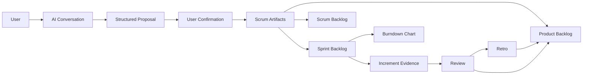

# Architecture Record

This document is the current architecture record for **ai product manager** Scrum MVP.

## Current Baseline

Runtime baseline:

- Next.js App Router
- React
- TypeScript
- Tailwind CSS
- Zod for schema validation
- Local dev persistence in `.data/scrum-store.json`
- Prisma schema present for production persistence

The current MVP stays as one Next.js application. The local Scrum workflow is now usable through API routes; production storage, auth, and ownership checks are still pending.

## Product Architecture

## UI Modules

| Module | Purpose |
| --- | --- |
| `ChatView` | Traditional AI conversation plus the in-chat 6-step Scrum builder. |
| `FlowPanel` | Shows the AI Scrum subflow and gates artifact mutation behind user actions. |
| `BacklogsView` | Shows Product Backlog, Scrum Backlog / proposal queue, and Sprint Backlog as three columns. |
| `BacklogDetailDrawer` | Opens from a backlog card and shows developer-facing technical requirements. |
| `ScrumView` | Shows Sprint Backlog beside Burndown chart and Review / Retro save flow. |
| `BurndownChart` | Shows ideal, actual history, and projected future remaining effort from API data. |
| `ReviewRetroPanel` | Captures sprint review and retrospective results. |
| `MarkdownExportDrawer` | Lets the user choose an AI agent preset and export all Scrum artifacts to Markdown. |
| `SixStageMcpTools` | Exposes the AI Chat six-step Scrum flow as MCP tools through `/api/mcp`. |
| `DecisionLog` | Planned audit trail for confirmed AI changes and human overrides. |

## Data Flow Rules

1. Chat messages can create proposals.
2. Proposals do not mutate artifacts until confirmed.
3. Confirmed proposals update Scrum artifacts through API routes.
4. Sprint Backlog status updates generate burndown data.
5. Done Sprint items generate Increment Evidence.
6. Review and retro outputs should feed future Product Backlog decisions.
7. Backlog cards expose technical requirements for developer handoff.
8. All core artifacts must be exportable to Markdown with optional AI agent prompts.
9. MCP tool calls use the same confirmation and persistence rules as UI-driven artifact changes.

## Core Domain Objects

| Object | Description |
| --- | --- |
| `Project` | User/team Scrum workspace. |
| `ArtifactProposal` | AI-suggested changes awaiting user confirmation. |
| `ProductBacklogItem` | Candidate product work item. |
| `ScrumSprint` | Sprint metadata, goal, dates, working days. |
| `SprintBacklogItem` | Committed sprint task linked to Product Backlog. |
| `IncrementEvidence` | Accepted or reviewable output. |
| `BurndownPoint` | Remaining work data for a sprint day. |
| `SprintReview` | Sprint review outcome. |
| `SprintRetro` | Retrospective outcome and action items. |
| `DecisionLogEntry` | Planned auditable record of important changes. |

## AI Layer

The AI layer should produce structured JSON, not only prose.

Main AI jobs:

- clarify user input
- draft Product Backlog
- generate acceptance criteria
- score priorities
- propose Sprint Backlog
- summarize progress
- prepare review and retro notes
- expose the six-stage Scrum flow as MCP tools for agent-facing workflows

Current behavior: `/api/ai/chat` calls DeepSeek when `DEEPSEEK_API_KEY` is configured and returns validated structured Product Backlog proposals. If provider access is missing or invalid, it falls back to a deterministic local structured proposal so the Scrum workflow remains usable.

Direct DeepSeek interface:

- `POST /api/ai/deepseek`
- `DEEPSEEK_BASE_URL=https://api.deepseek.com`
- `DEEPSEEK_FAST_MODEL=deepseek-v4-flash`
- `DEEPSEEK_STRONG_MODEL=deepseek-v4-pro`

AI output must be validated with Zod before it becomes an artifact proposal.

MCP interface:

- `GET /api/mcp` for local tool discovery.
- `POST /api/mcp` for JSON-RPC `initialize`, `tools/list`, and `tools/call`.
- Tool definitions and implementation live in `src/server/mcp/six-stage-tools.ts`.
- Tool documentation lives in [mcp-six-stage-tools.md](./mcp-six-stage-tools.md).
- Prompt documentation lives in [ai-chat-six-stage-prompts.md](./ai-chat-six-stage-prompts.md).
- Mutating tools require explicit user confirmation and `confirmed: true`.

## Burndown Implementation

The MVP renders burndown as a custom SVG React component.

Required series:

- ideal remaining
- actual remaining history
- projected remaining
- blocked count
- scope change

Future sprint days must not be rendered as real actual progress. Use `actualRemaining: null` for future points and `projectedRemaining` for forecast display.

The data model should remain compatible with a future Chart.js or Recharts migration.

## Persistence Plan

Current dev persistence is server-side local JSON in `.data/scrum-store.json`. It exists so the UI can run a real workflow before production storage is wired.

This local store is not the production source of truth. It must be replaced by Prisma-backed services before multi-user or hosted use.

For a real multi-user MVP:

- use Prisma Postgres or equivalent managed Postgres
- store all Scrum artifacts server-side
- store messages separately from artifacts
- record confirmed AI changes in decision log
- do not treat chat history as the source of truth

## API Boundary

The app must preserve route handlers for product, sprint, sprint task updates, burndown, review, retro, upload, AI chat, and artifact proposals.
The app must also preserve Markdown export, backlog technical documentation, and MCP tool endpoints.

See [api-contract.md](./api-contract.md) for the current API surface.

UI implementation should be replaceable without changing these contracts.

## Integration Boundary

Do not build Jira, Linear, GitHub Projects, Notion, or Slack integrations before the local Scrum workflow is stable.

Future integrations should export/import artifacts, not replace the internal artifact model.

## Architecture Constraints

- Keep the app Vercel-friendly.
- Avoid adding a separate backend service for the MVP.
- Avoid Redis/BullMQ unless the product outgrows serverless-friendly workflows.
- Keep AI provider routing isolated from business logic.
- Keep UI style aligned with `docs/scrum-mvp/ui-ux-style.md`, `UI/*.png`, and the user's `UI_sample/` theme references.
- Do not ship demo-only state as the source of truth.
- Every core UI feature needs a matching API and persistence path.
